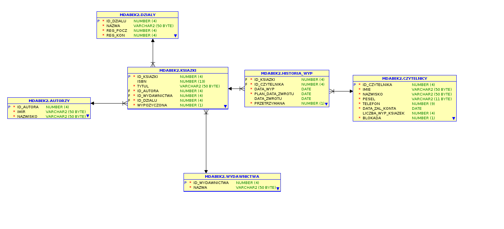

# Biblioteka – Oracle SQL Database Project

## Opis projektu

Celem projektu było zaprojektowanie kompletnej struktury relacyjnej bazy danych oraz implementacja funkcjonalności wspierających działanie systemu bibliotecznego w **Oracle SQL**.

System umożliwia przechowywanie informacji o książkach, autorach, wydawnictwach, gatunkach oraz czytelnikach, a także automatyzuje obsługę wypożyczeń i zwrotów wraz z kontrolą dostępności książek.

## Funkcjonalności

System umożliwia:

- rejestrację nowych czytelników,
- dodawanie książek, autorów, wydawnictw, gatunków i działów,
- wypożyczanie oraz zwracanie książek,
- automatyczną aktualizację statusu dostępności książek,
- prowadzenie historii wszystkich wypożyczeń,
- monitorowanie liczby aktualnie wypożyczonych książek przez czytelników,
- automatyczne blokowanie kont czytelników posiadających zaległe wypożyczenia lub przekraczających limit wypożyczonych książek,
- wyszukiwanie książek według autora, gatunku, wydawnictwa lub działu,
- wyświetlanie historii wypożyczeń wybranego czytelnika,
- wyznaczanie fizycznej lokalizacji książki w bibliotece,
- generowanie statystyk dotyczących czytelników oraz najczęściej wypożyczanych autorów i wydawnictw,
- identyfikowanie przetrzymanych książek oraz czytelników posiadających zaległości.

## Model bazy danych

Baza danych składa się z siedmiu głównych relacji:

- **Książki**
- **Czytelnicy**
- **Historia Wypożyczeń**
- **Autorzy**
- **Wydawnictwa**
- **Gatunki**
- **Działy**

Zależności pomiędzy tablicami zostały zaprojektowane zgodnie z zasadami relacyjnych baz danych z wykorzystaniem kluczy głównych i obcych zapewniających integralność danych.

### Model ER

Diagram ER przedstawiający strukturę bazy danych:

## Automatyzacja

Projekt wykorzystuje mechanizmy Oracle SQL do automatyzacji procesów związanych z obsługą biblioteki, między innymi:

- automatyczną zmianę statusu książki po wypożyczeniu i zwrocie,
- aktualizację liczby wypożyczonych książek przez czytelnika,
- zapisywanie historii wypożyczeń,
- blokowanie i odblokowywanie kont czytelników na podstawie zdefiniowanych reguł biznesowych.

# Technologie

- Oracle SQL
- SQL Developer
- Relacyjne bazy danych
- Model ER
- Klucze główne i obce
- Ograniczenia
- Funkcje
- Procedury
- Wyzwalacze

